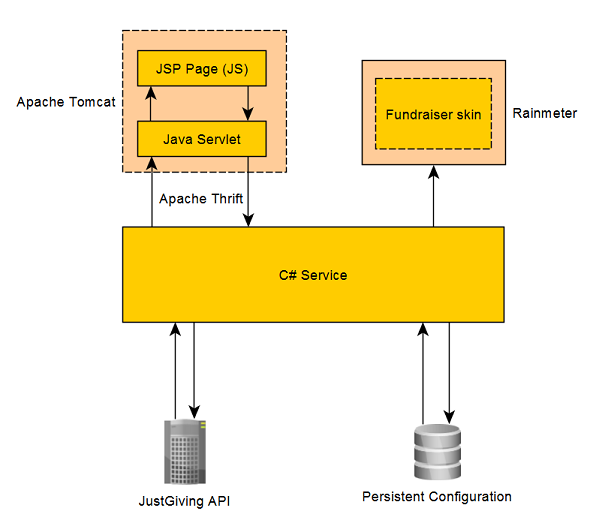

# JustGivingService
The JustGivingService is a collection of Windows and web applications which allows anyone to see the current status of a JustGiving fundraiser by simply glancing at their desktop. Details displayed include current funding level, target funding level, and a list of recent donations. Configuration is done via a simple and easy to use Web UI, and the details displayed on the desktop are updated in real-time using JustGiving’s publically available API.

The installation instructions below, where applicable, relate to installing the service on Windows 7.

#### Contents
1. [Prerequisites](https://github.com/dhickie/JustGivingService#prerequisites)
2. [Installation](https://github.com/dhickie/JustGivingService#installation)
  1. [Service installation instructions](https://github.com/dhickie/JustGivingService#service-installation-instructions)
  2. [JRE installation instructions](https://github.com/dhickie/JustGivingService#jre-installation-instructions)
  3. [Apache Tomcat installation instructions](https://github.com/dhickie/JustGivingService#apache-tomcat-8-installation-instructions)
  4. [Rainmeter installation instructions](https://github.com/dhickie/JustGivingService#rainmeter-installation-instructions)
  5. [Creating new environment variables](https://github.com/dhickie/JustGivingService#creating-new-environment-variables)
3. [Configuration](https://github.com/dhickie/JustGivingService#configuration)
  1. [Changing fundraiser page](https://github.com/dhickie/JustGivingService#changing-fundraiser-page)
  2. [Other configuration options](https://github.com/dhickie/JustGivingService#other-configuration-options)
4. [Development](https://github.com/dhickie/JustGivingService#development)
  1. [Tools](https://github.com/dhickie/JustGivingService#tools)
  2. [Architecture](https://github.com/dhickie/JustGivingService#architecture)
  3. [Outputting fundraising data](https://github.com/dhickie/JustGivingService#outputting-fundraising-data)
  4. [Working with the JavaScript layer](https://github.com/dhickie/JustGivingService#working-with-the-javascript-layer)
  5. [Future work](https://github.com/dhickie/JustGivingService#future-work)

## Prerequisites
There are number of prerequisites needed to use the JustGivingService:
-	.Net 4.5
-	Java Runtime Environment 8
-	Apache Tomcat 8
-	Rainmeter

Instructions for installing most of these can be seen below.

## Installation
#### Service Installation instructions
To install the JustGivingService, follow these steps:

1.	If not already installed, install .Net 4.5.
2.	Install the Java Runtime Environment. If this is already installed, ensure the `JRE_HOME` environment variable is set (see below).
3.	Install Apache Tomcat 8. If this is already installed, ensure Tomcat is configured to run as a Windows service, `CATALINA_HOME` environment variable is set, and Tomcat is running on port `8080` (see below).
4.	Install Rainmeter. If this is already installed, two custom environment variables need to be set, `RAINMETER_HOME` and `RAINMETER_SKINS_HOME` (see below).
5.	Restart the computer.
6.	Download the latest version of the JustGivingService from the Releases folder above, and extract the archive to the location you wish to install the service to.
7.	Double click `Install.exe`.

#### JRE Installation instructions
To install the Java Runtime Environment, do the following:

1.	Download the latest version of JRE 8 from [here](http://www.oracle.com/technetwork/java/javase/downloads/jre8-downloads-2133155.html).
2.	Run the installer.
3.	Create a new environment variable, `JRE_HOME`, with a value of the location you installed the JRE to. By default this will be something similar to `C:\Program Files (x86)\Java\jre1.8.0_66`.

#### Apache Tomcat 8 installation instructions:
To install Apache Tomcat 8, do the following:

1.	Download the core zip distribution of Tomcat 8 from [here](https://tomcat.apache.org/download-80.cgi).
2.	Extract the zip file to where you want Tomcat to be installed.
3.	Create a new environment variable, `CATALINA_HOME`, with a value of the path to the Tomcat `/bin` directory. For example if you extracted the downloaded archive to the root of the C drive, this would look similar to `C:\apache-tomcat-8.0.28`.
4.	Start a command prompt, and enter the following commands in order:
  1.	`%CATALINA_HOME%\bin\service.bat install`
  2.	`%CATALINA_HOME%\bin\tomcat8.exe //US//Tomcat8 --Startup=auto`
  3.	`%CATALINA_HOME%\bin\tomcat8.exe start`

#### Rainmeter installation instructions:
To install Rainmeter, do the following:

1.	Download the latest version of Rainmeter from [here](http://www.rainmeter.net/).
2.	Run the installer. Tick the option to start Rainmeter when Windows starts.
3.	Create two new environment variables:
  1.	`RAINMETER_SKINS_HOME` – This should have a value of the Rainmeter skins directory. By default this will be `C:\Users\{YourUsername}\Documents\Rainmeter\Skins`
  2.	`RAINMETER_HOME` – This should have a value of the directory you installed Rainmeter to. By default this will look similar to `C:\Program Files\Rainmeter`.
4.	Start Rainmeter.
5.	(Optional) The first time Rainmeter is run, it will load a number of default skins that are not required. These can be disabled by doing the following:
  1.	From the system tray, double click the Rainmeter icon.
  2.	In the resulting window, select each item in turn from the “Active skins” dropdown box, and click “Unload” for each.

#### Creating new environment variables
To create a new environment variable, do the following:

1.	Go to Start -> Control Panel.
2.	From the control panel, go to System -> Advanced system settings.
3.	At the bottom of the resulting window, click “Environment Variables...”.
4.	Click “New...” in the `System variables` section and enter a new name and value for the environment variable.

## Configuration
#### Changing fundraiser page
By default, the JustGivingService is configured to display the details of my fundraiser from last year, when I (attempted) to grow a moustache. Configuring it to look at a different page is easy:

1. Looking at the rainmeter skin on your desktop, click on the cog icon in the top right.
2. This launches your web browser and brings up the configuration screen. Enter the Page ID of the fundraiser you want to follow. (If you browse to the page you're interested in on the JustGiving site, this is the text that appears in the URL after `https://www.justgiving.com/`).
3. Click save. The next time the service gets an update from JustGiving's servers it will display the details of the new fundraising page in the Rainmeter skin.

#### Other configuration options
There are a couple of other options here for configuring the service:
- `Rainmeter exe location` - This should point to the location on your computer where you have Rainmeter installed.
- `Polling period (ms)` - This is how often (in milliseconds) you want the service to check with JustGiving's servers to see if any details of the fundraising page have changed. The default is 10 seconds.

## Development
Should you choose to further develop this, here's some information to help you on your way.

#### Tools
There are a few tools used for development (all of them free) which you'll need if you do any development:
- Visual Studio Express/Community 2015 ([link](https://www.visualstudio.com/en-us/downloads/download-visual-studio-vs.aspx))
- Eclipse for Java Developers ([link](https://eclipse.org/downloads/))
- Node JS ([link](https://nodejs.org/en/download/))

You'll also need some sort of text editor if you want to do any work on the JavaScript layer. Personally I used Sublime Text.

#### Architecture
The service's overall architecture is designed to be fairly modular, to make any potential future development as easy as possible. There are 3 main components:
- **C# Service** - This is the meat of the application. It co-ordinates the other components and deals with polling the JustGiving API, storing fundraising data, reacting to configuration changes and outputting fundraising data to the screen.
- **Rainmeter skin** - With version 1, this is the only way to actually display the fundraising data on the desktop. The C# process tells the skin what to display via command line arguments to the Rainmeter executable.
- **Configuration page** - This is a JSP page running on Tomcat which allows the user to edit the current configuration, by making use of React JS and Bootstrap. Getting and setting the configuration from the C# process is done via a Java servlet (also running on Tomcat), which then communicates with the C# process via Apache Thrift.

Here's a diagram of how everything fits together:

#### Outputting fundraising data
Version 1 only comes with one data outputter, which displays fundraising data in a Rainmeter skin. However, if you want to cater for outputting fundraising data to a different application, you can do so relatively easily:
- In the C# service project, create a new class in the DataOutputters folder which inherits from the DataOutputter class and deals with outputting fundraising data to your external application of choice.
- Modify the DataOutputController class to use your new class instead of the pre-existing RainmeterOutputter.

#### Working with the JavaScript layer
The JavaScript code used by the configuration screen front-end makes use of several JavaScript libraries to make things work nicely. If you want to do work here you'll need to get these packages locally:
- Open a command line instance and navigate to `Source\ServiceConfig\ReactComponents`.
- Run the command `npm install -g browserify`
- Run the command `npm install`

Now, whenever you've made changes to any JavaScript then you can run `build.bat` from the directory mentioned above to bundle all the code into a single file, `bundle.js`, which is run on the JSP page.

#### Future work
There are a few things I know could be improved, and would like to do when I, or anyone else, has the time.
- **Allow multiple fundraisers** - Most of the C# code is structured around the idea that a user might want to specify multiple fundraising pages they want to follow. However, at the moment the Rainmeter skin only supports a single page at a time. I'd like to update this to allow multiple pages, and also update the config page to allow the same.
- **Allow search from the config page** - It isn't the best solution to rely on the user knowing their fundraiser page ID when they're editing the service configuration. I'd like to have a search bar on the configuration page which lets used search for a fundraising page before selecting it.
- **Make the build proccess less horrible** - At the moment, all the different layers are compiled separately using different tools. And when they're built, they're not automatically put in the right place to run a debug build. It would be nice if there was a single command that could be run from the command line to build, bundle and install all the current code.
- **Make configuration changes more responsive** - At the moment, whenever the service configuration is changed through the configuration UI, the user has to wait for the next update cycle to come around before the data for the new fundraiser is outputted to the screen. It would be nice if instead the update happened immediately using the new configuration.
- **Improve the configuration UI** - At the moment the configuration UI looks a little slapdash. It could do with a once-over to make text boxes a more appropriate size and make things line up nicer.
- **Tests** - If this is going to get any bigger or more elaborate, one of the first steps should be adding some automated tests to make sure everything does what it's supposed to.
- **Logging** - Similar to above, a proper logging framework is needed to help debugging.
- **Other improvements** - Other miscellaneous improvements:
  - The Rainmeter install directory doesn't really need to be in the service configuration since it's in an environment variable from the service install.
  - Move all constants in to a single file in the C# layer.
  - Move all string constants that get displayed on screen in to a Messages file to make localisation easy.
